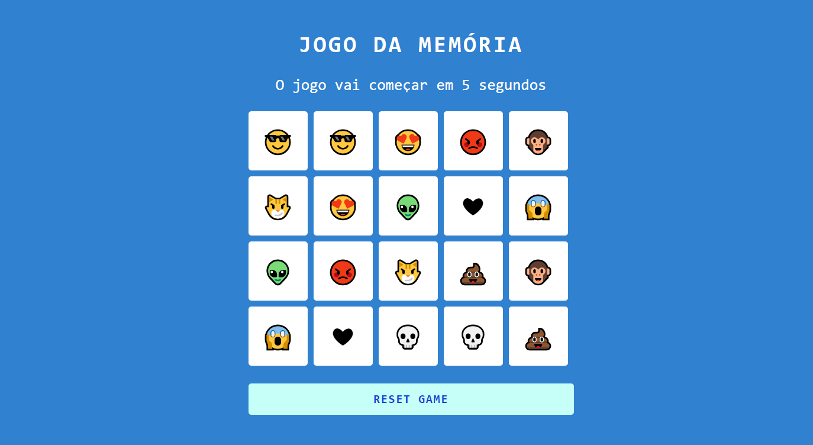
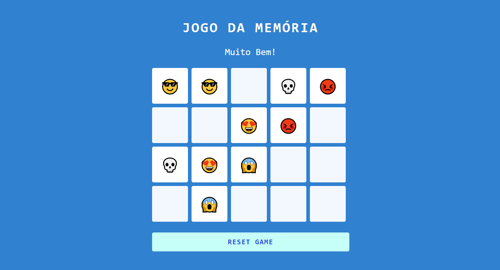

# Memory Game 

## Um jogo da Memória 

Desenvolvi esse joguindo da memória pelas aulas do bootcamp Potência Tech Ifood - Desenvolvimento de Jogos ds DIO , Usando HTML , CSS e JavaScript  

### Construído com

# AVISO ⚠

Aparentemente no navegador Safari a propriedade "::after" não está funcionando nesse projeto , então as cartas não viram 😥
